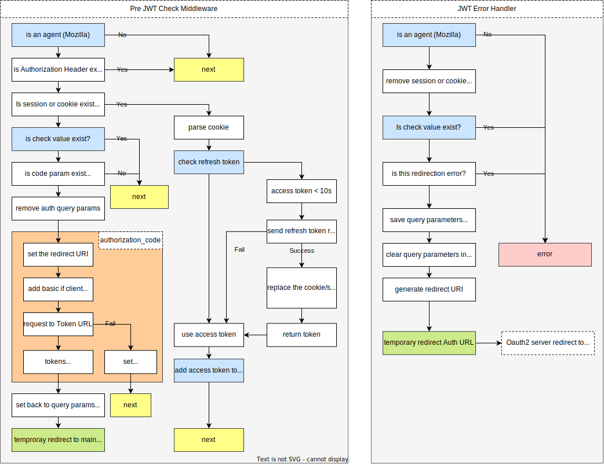

# Auth

Authenticating and authorizing client/server applications.

## Usage

```sh
go get github.com/worldline-go/auth
```

Check http example: [example/http](example/http)

### Client

Client is usefull to send request with oauth2 token.

First set a provider.

```go
var providerClient = auth.Provider{
	Keycloak: &providers.KeyCloak{
		ClientID:     "test",
		ClientSecret: "my_client_secret",
        // Keycloak server url
		BaseURL:      "http://localhost:8080",
		Realm:        "finops",
        // Scopes is optional
		Scopes:       []string{"openid", "profile", "email", "offline_access"},
	},
}
```

Then when you create a http.Client you can use the oauth2 transport.

```go
provider := providerClient.ActiveProvider()
if == nil {
	return fmt.Errorf("no active provider")
}

roundTripper, err := provider.RoundTripper(ctx, http.DefaultTransport)
if err != nil {
	return fmt.Errorf("creating round tripper: %w", err)
}

client := &http.Client{
    Transport: roundTripper,
}
```

Now you can make request with this client.

### Server

Check the token in the request. Just need to url of keycloak server and the realm.

```go
var providerServer = auth.Provider{
	Keycloak: &providers.KeyCloak{
        // Keycloak server url
		BaseURL: "http://localhost:8080",
		Realm:   "finops",
	},
}
```

Then you can check the token in the request.

This is the http based, very simple function but check the our [echo middleware](middlewares/authecho/README.md) to much more advanced operations.

```go
provider := providerServer.ActiveProvider()
if provider == nil {
	return fmt.Errorf("no active provider")
}

keyFunc, err := provider.JWTKeyFunc(auth.WithContext(ctx))
if err != nil {
	return fmt.Errorf("creating parser: %w", err)
}

// if you don't use the context cancelation, you can use this
// defer keyFunc.EndBackground()

// Check the token in the request
claimsValue := claims.Custom{}
token, err := keyFunc.Parser(tokenToCheck, &claimsValue)
if err != nil {
    return fmt.Errorf("token 👎: %w", err)
}
```

## Redirection Flow

When enabled redirection in the middleware, the user will be redirected to the oauth2 login page.

This is not a standard flow and we can change update it any time.  
Code for echo middleware is [here](middlewares/authecho/README.md).


